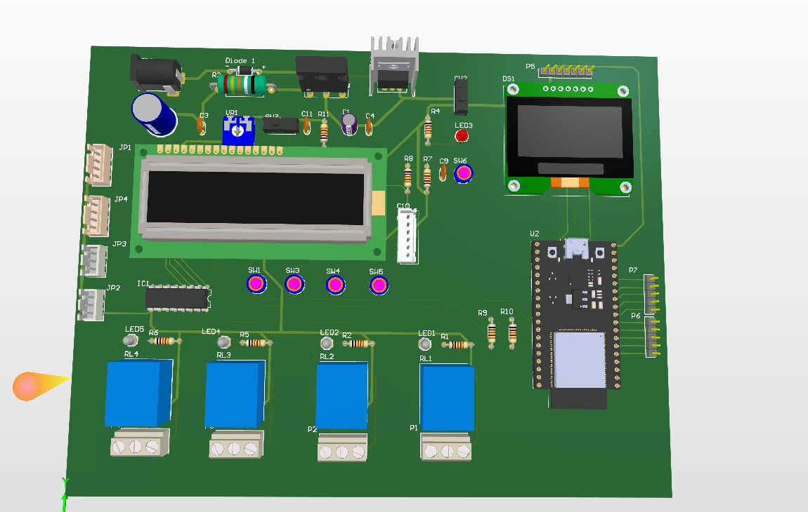
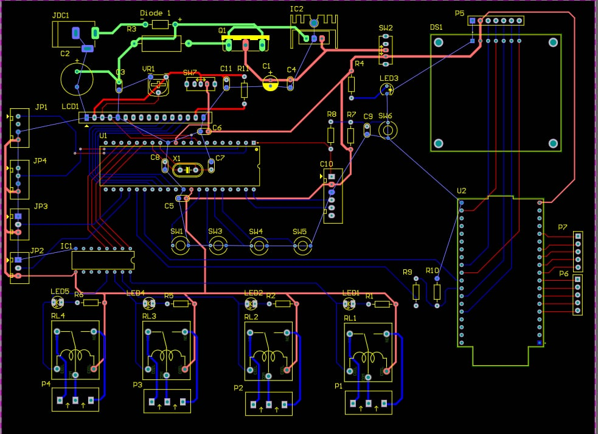

# Smart Home Embedded Real-Time Control System

[]()
[]()
[]()

A comprehensive, real-time smart home control system built from scratch, spanning the full embedded development lifecycle: from hardware schematic design and two-layer PCB routing to low-level bare-metal driver development and multi-sensor integration.

---

## 🚀 Key Features & Technical Highlights

* **Bare-metal Driver Development:** Written entirely in C for optimal hardware control, peripheral initialization, and memory-efficient data acquisition.
* **Real-Time Constraint Management:** Implemented an **interrupt-driven I/O handling** architecture to process critical sensor changes and user inputs with minimal latency.
* **Dual-Controller Subsystem:** Integrates a robust 8-bit **PIC16F877A** for core deterministic control, paired with an **ESP32 DevKit** to offload secondary tasks or future IoT capabilities.
* **Hardware-Software Co-Design:** Engineered custom circuitry featuring isolation, power decoupling, and proper signal integrity practices.

---

## 🛠️ Hardware System Architecture

### 1. Schematic Design
The system architecture isolates high-power loads from the digital control logic and ensures clean power distribution across different voltage domains ($5\text{V}$ and $3.3\text{V}$).

* **Power Supply:** LM7805-based voltage regulation with decoupling capacitors ($1000\mu\text{F}$ and $100\mu\text{F}$) for noise suppression.
* **Relay Isolation Driver:** Uses a **ULN2003A** Darlington transistor array to drive four $12\text{V}/5\text{V}$ mechanical relays safely, preventing inductive kickback from damaging the microcontrollers.
* **Human-Machine Interface (HMI):** Integrates both a 16x2 Character LCD (Parallel interface) and an I2C OLED Display for real-time system state visualization.

### 2. PCB Layout (Two-Layer Board)
Routed using **Altium Designer** with a clear separation between high-current AC/DC load tracks and sensitive high-frequency digital signal tracks (e.g., $20\text{MHz}$ Crystal Oscillator circuit).

| 3D Top Side View | 2D Routing Copper Top/Bottom |
| :---: | :---: |
|  |  |

---

## 💻 Firmware Design

The firmware focuses heavily on low-level peripheral manipulation through direct register access.

### Peripheral Integration
* **Sensors:** Real-time data acquisition from Temperature, Light (LDR), and Motion (PIR) sensors using a mix of ADC polling and external interrupts.
* **Interrupt Service Routines (ISR):** Configured to handle asynchronous hardware events (e.g., button presses, motion detection triggers) without blocking the main super-loop.
* **Display Drivers:** Custom character-mapping and timing logic implemented to communicate with the LCD16x2.

---

## 📂 Repository Structure

```text
├── driver/             # Bare-metal C driver source files (.c, .h)
├── image/              # Hardware schematics, PCB layout designs, and 3D renders
│   ├── SCHEMATIC.PNG.jpg
│   ├── PCB_ROUTING.jpg
│   ├── PCB_TOPSIDE.jpg
│   └── PRODUCTION.PNG.jpg
├── BOM.pdf             # Bill of Materials (Component tracking)
├── Schematic.pdf       # High-resolution hardware schematic
└── README.md           # Project documentation
